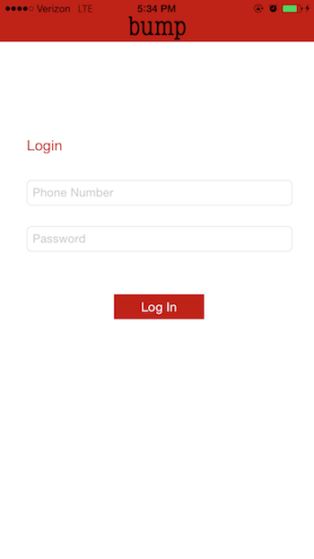

# Bump

The capstone project at Development Bootcamp that I alongside two other teammates built in eight days, Bump is an application that tracks a user's contacts, notifying them and the user if they are within a one thousand foot radius of one another - allowing them to "Bump" into each other. As the only group at Development Bootcamp to take on a native iOS application all year, we dove headfirst into Objective C and Xcode in order to create the user interface and login screen, as well as to generate asynchronous queries to our Rails API that stored and served back user data. Bump is still in the prototype stage, but we're hoping to add new features in the future.

## Creators:
1. [Peter Macaluso](https://github.com/pmacaluso3), the backend wizard.
2. [Nisk Siefken](https://github.com/nsiefken), push notification master and group lead.
3. [Bo Guthrie](https://github.com/boguth), Xcoder, Objective-C'er, and front end maker.

*Note - This repo does not include the rails API we built as a part of this project. To see that, visit [the Bump server](https://github.com/pmacaluso3/BumpBoysServer).

## Sample Screen Shots

## System Requirements
- Ruby 2.0.0
- Rails 4.0.3
- Postgres 9.3.2
- Xcode 6.4

## Gems
Houston: Apple Push Notification gem for Ruby.
  - Repo and docs: [https://github.com/nomad/houston](https://github.com/nomad/houston)

Whenever: Background worker for rails. Allows tasks to be run at scheduled intervals.
  - Repo and docs: [https://github.com/javan/whenever](https://github.com/javan/whenever)

## User Stories

## Schema

