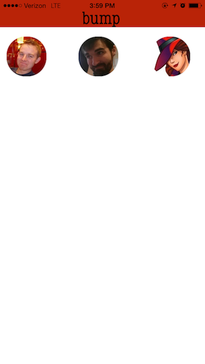

# Bump

The capstone project at Development Bootcamp that I alongside two other teammates built in eight days, Bump is an application that tracks a user's contacts, notifying them and the user if they are within a one thousand foot radius of one another - allowing them to "Bump" into each other. As the only group at Development Bootcamp to take on a native iOS application all year, we dove headfirst into Objective C and Xcode in order to create the user interface and login screen, as well as to generate asynchronous queries to our Rails API that stored and served back user data. Bump is still in the prototype stage, but we're hoping to add new features in the future.

## Creators:
1. [Peter Macaluso](https://github.com/pmacaluso3), the backend wizard.
2. [Nisk Siefken](https://github.com/nsiefken), push notification master and group lead.
3. [Bo Guthrie](https://github.com/boguth), Xcoder, Objective-C'er, and front end maker.

*Note - This repo does not include the rails API we built as a part of this project. To see that, visit [the Bump server](https://github.com/pmacaluso3/BumpBoysServer).

## Sample Screen Shots

## System Requirements
- Ruby 2.0.0
- Rails 4.0.3
- Postgres 9.3.2
- Xcode 6.4
- iOS 8

## Gems
Houston: Apple Push Notification gem for Ruby.
  - Repo and docs: [https://github.com/nomad/houston](https://github.com/nomad/houston)

Whenever: Background worker for rails. Allows tasks to be run at scheduled intervals.
  - Repo and docs: [https://github.com/javan/whenever](https://github.com/javan/whenever)

## User Stories
### MVP
- As a user, I want to be able to log in to the app.
- As a user, I want to see on my screen pictures of all the friends who are in my contacts list and have bump and who are within a 1000ft radius of myself.
- As a user, I want to recieve notifications whenever friends enter my geofence, and only when they enter my geofence.
- As a user, I want my interface to be dynamically updated, loading user pictures whenever the amount of friends I have within a 1000ft radius changes.
- As a user, I want the app the run in the background.
- As a user, I want the app to collect my contacts.
- As a user, I want the app to ask me permission to use my contacts, locations, and to send me push notifications.

### Future Features
- As a user, I want to be able to tap my friends' pictures and call them.
- As a user, I want to be able to create an account.
- As a user, I want to be able to logout.
- As a user, I want to be able to add friends to chat channels on the fly.
- As a user, I want to be able to set my preferred geofenced radius.
- As a user, I want to be able to enter "incognito mode" so that I don't show up on others' screens and they don't show up on mine.

## Schema

